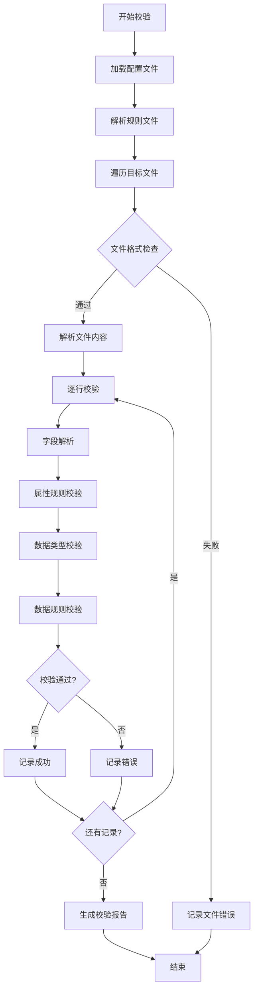

# XDR数据校验工具 - 跨语言实现设计文档

## 1. 系统概述

### 1.1 功能描述
XDR数据校验工具是一个用于验证电信、网络等领域XDR（eXternal Data Representation）数据文件格式、内容和规则的自动化校验系统。

### 1.2 核心特性
- **多格式支持**: txt、tar.gz、tar压缩文件
- **灵活规则系统**: 12种属性规则 + 16种数据规则
- **条件校验**: 字段间依赖关系处理
- **抽样检查**: 支持随机抽样校验
- **详细报告**: 完整的错误信息记录

---

## 2. 系统架构设计

### 2.1 整体架构图
```
┌─────────────────┐    ┌─────────────────┐    ┌─────────────────┐
│   配置文件管理    │    │   文件解析模块    │    │   规则解析引擎    │
│  - INI配置      │◄──►│  - 压缩文件解析  │◄──►│  - 属性规则解析  │
│  - Excel规则    │    │  - 文本文件解析  │    │  - 数据规则解析  │
└─────────────────┘    └─────────────────┘    └─────────────────┘
         │                        │                        │
         ▼                        ▼                        ▼
┌─────────────────┐    ┌─────────────────┐    ┌─────────────────┐
│   校验执行引擎    │    │   类型校验模块    │    │   结果输出模块    │
│  - 字段校验流程  │◄──►│  - IP地址验证    │◄──►│  - 错误报告生成  │
│  - 条件处理逻辑  │    │  - 数据类型验证  │    │  - 统计信息输出  │
└─────────────────┘    └─────────────────┘    └─────────────────┘
```

### 2.2 模块划分

#### 2.2.1 核心模块
1. **配置管理模块** (ConfigManager)
2. **文件解析模块** (FileParser)
3. **规则解析模块** (RuleParser)
4. **校验执行模块** (Validator)
5. **结果输出模块** (ResultExporter)

#### 2.2.2 辅助模块
1. **IP地址验证模块** (IPValidator)
2. **数据类型验证模块** (TypeValidator)
3. **压缩文件处理模块** (ArchiveHandler)
4. **错误处理模块** (ErrorHandler)

---

## 3. 数据结构设计

### 3.1 核心数据结构

#### 3.1.1 字段定义 (FieldDefinition)
```typescript
interface FieldDefinition {
    name: string;           // 字段名称
    type: string;           // 数据类型 (int, ip, datetime, etc.)
    attribute: Attribute;   // 属性规则
    rule: Rule;            // 数据规则
    required: boolean;      // 是否必填
}
```

#### 3.1.2 属性规则 (Attribute)
```typescript
interface Attribute {
    type: AttributeType;    // 规则类型
    condition: Condition;   // 条件信息
    parameters: any[];      // 参数列表
}

enum AttributeType {
    REQUIRED = "required",      // 必填
    OPTIONAL = "optional",      // 选填
    CONDITIONAL_EQ = "eq",      // 条件相等
    CONDITIONAL_NE = "ne",      // 条件不等
    ARRAY = "array",            // 数组匹配
    LOOP = "loop",              // 循环控制
    OFFSET = "offset",          // 偏移量
    JUMP = "jump",              // 跳转
    COMPLEX = "complex",        // 复杂条件
    IP_TYPE = "ip_type",        // IP类型条件
}
```

#### 3.1.3 数据规则 (Rule)
```typescript
interface Rule {
    type: RuleType;         // 规则类型
    operator: string;       // 操作符 (=, >, <, etc.)
    value: any;            // 规则值
    regex?: string;        // 正则表达式
}

enum RuleType {
    LENGTH = "length",      // 长度规则
    SIZE = "size",          // 数值大小
    FIXED_VALUE = "fixed",  // 固定值
    RANGE = "range",        // 值范围
    REGEX = "regex",        // 正则匹配
    JSON_FIELD = "json",    // JSON字段
}
```

### 3.2 校验结果结构
```typescript
interface ValidationResult {
    filePath: string;       // 文件路径
    lineNumber?: number;    // 行号（如果有）
    fieldName: string;      // 字段名称
    fieldValue: string;     // 字段值
    status: "pass" | "fail"; // 校验状态
    errorMessage?: string;  // 错误信息
    ruleType: string;       // 违反的规则类型
}

interface FileValidationResult {
    fileName: string;       // 文件名
    totalRecords: number;   // 总记录数
    passedRecords: number;  // 通过记录数
    failedRecords: number;  // 失败记录数
    results: ValidationResult[]; // 详细结果
}
```

---

## 4. API接口设计

### 4.1 核心接口

#### 4.1.1 校验器接口 (IValidator)
```typescript
interface IValidator {
    // 初始化校验器
    initialize(config: ValidatorConfig): Promise<void>;
    
    // 校验单个文件
    validateFile(filePath: string, options?: ValidationOptions): Promise<FileValidationResult>;
    
    // 校验目录
    validateDirectory(dirPath: string, options?: ValidationOptions): Promise<DirectoryValidationResult>;
    
    // 加载规则配置
    loadRules(ruleConfig: RuleConfig): Promise<void>;
    
    // 获取校验统计
    getStatistics(): ValidationStatistics;
}
```

#### 4.1.2 文件解析器接口 (IFileParser)
```typescript
interface IFileParser {
    // 解析文件内容
    parse(filePath: string): Promise<ParsedFile>;
    
    // 支持的文件格式
    supportedFormats(): string[];
    
    // 检查文件格式
    canParse(filePath: string): boolean;
}

interface ParsedFile {
    fileName: string;
    records: Record[];
    encoding: string;
    lineCount: number;
}

interface Record {
    lineNumber: number;
    fields: string[];
    rawLine: string;
}
```

#### 4.1.3 规则解析器接口 (IRuleParser)
```typescript
interface IRuleParser {
    // 解析属性规则
    parseAttribute(ruleString: string): Attribute;
    
    // 解析数据规则
    parseRule(ruleString: string): Rule;
    
    // 验证规则语法
    validateRuleSyntax(ruleString: string): boolean;
    
    // 获取支持的规则类型
    getSupportedRuleTypes(): string[];
}
```

### 4.2 配置接口

#### 4.2.1 校验器配置
```typescript
interface ValidatorConfig {
    // 基本配置
    encoding: string;               // 文件编码
    delimiter: string;              // 字段分隔符
    samplingRate?: number;          // 抽样率 (0-1)
    maxFileSize?: number;           // 最大文件大小
    
    // 规则配置
    ruleFiles: string[];            // 规则文件路径
    strictMode: boolean;            // 严格模式
    
    // 输出配置
    outputFormat: "json" | "csv" | "html";
    outputPath?: string;
    verbose: boolean;               // 详细输出
}
```

#### 4.2.2 规则配置
```typescript
interface RuleConfig {
    version: string;                // 规则版本
    fields: FieldDefinition[];      // 字段定义
    filePatterns: FilePattern[];    // 文件模式匹配
    validationRules: ValidationRule[]; // 验证规则
}

interface FilePattern {
    name: string;                   // 模式名称
    prefix: string[];               // 文件前缀
    suffix: string;                 // 文件后缀
    minSize?: number;               // 最小文件大小
    contentCheck: boolean;          // 是否校验内容
}
```

---

## 5. 校验流程设计

### 5.1 主校验流程


### 5.2 字段校验详细流程
```typescript
async function validateField(
    fieldDef: FieldDefinition, 
    fieldValue: string, 
    context: ValidationContext
): Promise<ValidationResult> {
    
    // 1. 检查属性规则
    const attrResult = await validateAttribute(fieldDef.attribute, fieldValue, context);
    if (!attrResult.passed) {
        return createFailedResult(fieldDef, fieldValue, attrResult.error);
    }
    
    // 2. 检查数据类型
    const typeResult = await validateType(fieldDef.type, fieldValue);
    if (!typeResult.passed) {
        return createFailedResult(fieldDef, fieldValue, typeResult.error);
    }
    
    // 3. 检查数据规则
    const ruleResult = await validateRule(fieldDef.rule, fieldDef.type, fieldValue);
    if (!ruleResult.passed) {
        return createFailedResult(fieldDef, fieldValue, ruleResult.error);
    }
    
    return createPassedResult(fieldDef, fieldValue);
}
```

---

## 6. 规则系统详细设计

### 6.1 属性规则语法规范

#### 6.1.1 基础规则
- `必填` - 字段必须存在且非空
- `选填` - 字段可选

#### 6.1.2 条件规则
```
必填|if($1==value)          # 当第1个字段等于value时必填
必填|if($1!=value)          # 当第1个字段不等于value时必填
必填|if($1==a,b,c)         # 当第1个字段等于a,b,c中任意值时必填
```

#### 6.1.3 复杂规则
```
必填|array(1,2,3)           # 数组循环规则
必填|loop(start=xxx)        # 循环控制规则
必填|offset(1,2)            # 偏移量规则
必填|jump=5                 # 跳转规则
必填|if($1==x);reg=pattern  # 正则比较规则
必填|if($1==x);type=ipv4,ipv6 # IP类型规则
```

### 6.2 数据规则语法规范

#### 6.2.1 长度规则
```
len = 10      # 长度等于10
len > 5       # 长度大于5
len < 10      # 长度小于10
len >= 5      # 长度大于等于5
len <= 10     # 长度小于等于10
```

#### 6.2.2 值范围规则
```
[value]        # 固定值
[1-100]        # 数值范围
[a,b,c]        # 枚举值
reg=pattern    # 正则匹配
size = 100     # 数值大小
```

### 6.3 类型系统

#### 6.3.1 支持的数据类型
- `int` - 整数
- `ip` / `ipv4` / `ipv6` - IP地址
- `datetime` - 日期时间 (yyyy-MM-dd HH:mm:ss)
- `base64` - Base64编码
- `base64_json` - Base64编码的JSON
- `json` - JSON格式

#### 6.3.2 IP地址类型细分
- `ip` - 通用IP
- `ip_compressed` - 压缩格式IP
- `ip_exploded` - 展开格式IP
- `ipv6_compressed` - IPv6压缩格式
- `ipv6_exploded` - IPv6展开格式

---

## 7. 错误处理设计

### 7.1 错误分类

#### 7.1.1 文件级错误
- 文件不存在或无法访问
- 文件格式不支持
- 文件编码错误
- 文件大小超限

#### 7.1.2 规则级错误
- 规则语法错误
- 规则配置冲突
- 规则文件格式错误

#### 7.1.3 数据级错误
- 字段缺失
- 数据类型错误
- 数据格式错误
- 规则校验失败

### 7.2 错误码设计
```typescript
enum ErrorCode {
    // 文件错误 (1000-1999)
    FILE_NOT_FOUND = 1001,
    FILE_ACCESS_DENIED = 1002,
    FILE_FORMAT_UNSUPPORTED = 1003,
    FILE_ENCODING_ERROR = 1004,
    
    // 规则错误 (2000-2999)
    RULE_SYNTAX_ERROR = 2001,
    RULE_CONFIG_ERROR = 2002,
    RULE_FILE_FORMAT_ERROR = 2003,
    
    // 数据错误 (3000-3999)
    FIELD_MISSING = 3001,
    FIELD_TYPE_ERROR = 3002,
    FIELD_FORMAT_ERROR = 3003,
    FIELD_RULE_VIOLATION = 3004,
}
```

---

## 8. 性能优化设计

### 8.1 内存优化
- 流式文件处理，避免一次性加载大文件
- 对象池技术，减少对象创建开销
- 缓存常用规则解析结果

### 8.2 并行处理
- 多文件并行校验
- 多线程/多进程处理
- 异步I/O操作

### 8.3 抽样优化
- 智能抽样算法
- 分层抽样策略
- 动态抽样率调整

---

## 9. 扩展性设计

### 9.1 插件架构
```typescript
interface IPlugin {
    name: string;
    version: string;
    
    // 插件初始化
    initialize(config: any): Promise<void>;
    
    // 处理校验前事件
    beforeValidation(context: ValidationContext): Promise<void>;
    
    // 处理校验后事件
    afterValidation(context: ValidationContext): Promise<void>;
    
    // 自定义规则支持
    supportsRuleType(ruleType: string): boolean;
    
    // 自定义数据类型支持
    supportsDataType(dataType: string): boolean;
}
```

### 9.2 自定义规则扩展
- 支持用户自定义规则语法
- 规则引擎插件化
- 动态规则加载

### 9.3 输出格式扩展
- 支持多种输出格式 (JSON, CSV, HTML, PDF)
- 自定义报告模板
- 实时进度监控

---

## 10. 测试策略

### 10.1 单元测试
- 规则解析器测试
- 类型校验器测试
- 文件解析器测试

### 10.2 集成测试
- 端到端校验流程测试
- 多文件格式兼容性测试
- 性能基准测试

### 10.3 回归测试
- 规则语法兼容性测试
- 错误处理完整性测试
- 边界条件测试

---

## 11. 部署和配置

### 11.1 环境要求
- 支持Python 3.6+或其他目标语言版本
- 必要的第三方库依赖
- 足够的磁盘空间和内存

### 11.2 配置文件示例
```ini
[VALIDATOR]
encoding = utf-8
delimiter = |
sampling_rate = 0.1
strict_mode = true
output_format = json
verbose = true

[FILE_PATTERNS]
pattern1 = header1,header2;.txt;1024;校验
pattern2 = header3;.tar.gz;2048;不校验
```

### 11.3 规则文件示例 (Excel/CSV格式)
```csv
字段名,数据类型,属性规则,数据规则
field1,int,必填,len=10
field2,ipv4,选填|if($1==value),[192.168.1.1-192.168.1.255]
field3,datetime,必填|array(1,2,3),reg=^\\d{4}-\\d{2}-\\d{2}
```

---

## 12. 跨语言实现建议

### 12.1 推荐实现语言
1. **Java**: 企业级应用，性能稳定，生态完善
2. **Go**: 高并发，部署简单，性能优秀
3. **Rust**: 内存安全，高性能，系统级应用
4. **Node.js**: 异步I/O，适合处理大量小文件

### 12.2 语言特性适配
- **类型系统**: 强类型语言需要更严格的类型定义
- **并发模型**: 根据语言特性选择合适的并发方案
- **错误处理**: 适配语言的错误处理机制
- **内存管理**: 考虑垃圾回收或手动内存管理

### 12.3 第三方库选择
- **文件处理**: 选择成熟的压缩文件处理库
- **正则表达式**: 使用语言内置或高性能正则库
- **配置解析**: 支持INI、JSON、YAML等格式
- **日志系统**: 集成成熟的日志框架

---

## 13. 后续优化方向

### 13.1 功能增强
- 支持更多文件格式 (XML, JSON, Parquet等)
- 机器学习辅助规则生成
- 实时数据流校验
- 分布式校验架构

### 13.2 性能优化
- 增量校验支持
- 缓存优化策略
- 并行算法优化
- 内存使用优化

### 13.3 用户体验
- 图形化配置界面
- 实时校验进度显示
- 智能错误修复建议
- 详细的帮助文档

---

## 附录

### A. 正则表达式参考
- IPv4: `^((\d{1,2})|(1\d{2})|(2[0-4]\d)|(25[0-5]))\.){3}((\d{1,2})|(1\d{2})|(2[0-4]\d)|(25[0-5]))$`
- IPv6: 复杂模式，建议使用语言内置IP验证
- 日期时间: `^\d{4}-\d{2}-\d{2} \d{2}:\d{2}:\d{2}$`

### B. 性能基准参考
- 单文件处理: < 1秒 (1MB文件)
- 内存使用: < 100MB (处理大文件时)
- 并发处理: 支持10+文件并行

### C. 兼容性要求
- 支持主流操作系统 (Windows, Linux, macOS)
- 支持Unicode字符集
- 向后兼容规则语法